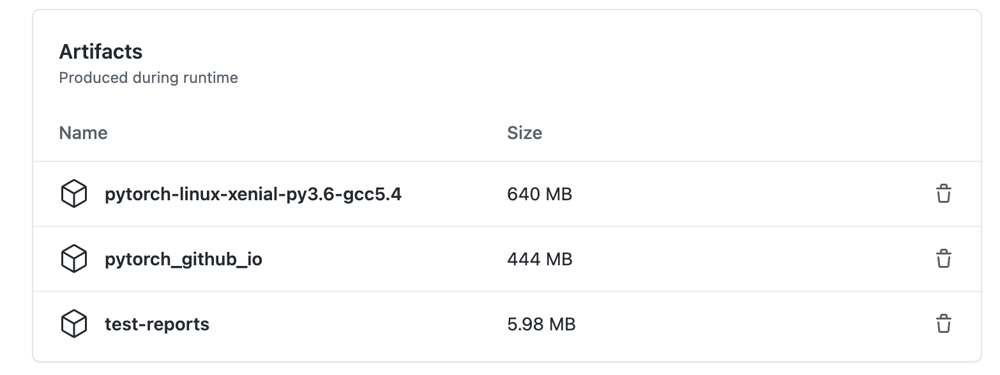

.. _developer-faq:

Developer FAQ
=============

.. contents:: :local:
    :depth: 2

Numerics
--------

Does PyTorch distinguish between different types of NaN like C++ does?
^^^^^^^^^^^^^^^^^^^^^^^^^^^^^^^^^^^^^^^^^^^^^^^^^^^^^^^^^^^^^^^^^^^^^^

No. PyTorch treats NaNs like Python does: there is only one floating point NaN and a complex number is NaN if either its real part is NaN, its imaginary part is NaN, or both parts are NaN. 

Why doesn't PyTorch let me compare complex numbers like NumPy?
^^^^^^^^^^^^^^^^^^^^^^^^^^^^^^^^^^^^^^^^^^^^^^^^^^^^^^^^^^^^^^

Complex numbers are not part of any totally ordered field, so comparisons between them are ambiguous. PyTorch follows Python3 in disallowing these comparisons. NumPy intends to update its behavior to match Python3 in the future, too. See the NumPy-issue_. 

PRs
---

My PR hasn't been reviewed in a while, what should I do?
^^^^^^^^^^^^^^^^^^^^^^^^^^^^^^^^^^^^^^^^^^^^^^^^^^^^^^^^

You can and should ping reviewers by ccing them in a comment if they haven't responded to a review request in 2 full working days. For example, if you request a review on Friday, you can ping your reviewers on Wednesday of the next week. 

My PR may change the documentation, how do I see the formatted doc?
^^^^^^^^^^^^^^^^^^^^^^^^^^^^^^^^^^^^^^^^^^^^^^^^^^^^^^^^^^^^^^^^^^^

Iterate on the docs locally.
""""""""""""""""""""""""""""

If you want to iterate on the docs locally, see CONTRIBUTING_ for instructions on building the docs locally.

Iterate on the docs from PR.
""""""""""""""""""""""""""""

If you've submitted a PR, make sure the following jobs are finished

* ``Linux CI (pytorch-linux-xenial-py3.6-gcc5.4)``

  * ``pytorch_python_doc_build``

And then you can download the artifacts (pytorch_github_io.zip) from the GitHub Action page of ``Linux CI (pytorch-linux-xenial-py3.6-gcc5.4)``. 

Unzip it, and you can follow how we build the docs ``site`` there: https://github.com/pytorch/pytorch.github.io#setup

.. code-block:: bash
  # Install rbenv and yarn dependencies for a jekyll website
  # Follow https://github.com/pytorch/pytorch.github.io
  cd <path_to>/pytorch.github.io

  # Serve the doc site locally
  make serve

My PR caused a build to fail, but it's not usually run in the Github CI. How do I test my PR against EVERY build?
^^^^^^^^^^^^^^^^^^^^^^^^^^^^^^^^^^^^^^^^^^^^^^^^^^^^^^^^^^^^^^^^^^^^^^^^^^^^^^^^^^^^^^^^^^^^^^^^^^^^^^^^^^^^^^^^^

Push your changes to a pytorch/pytorch branch named ci-all/<your name here>. That will trigger all the test builds, not just the ones that typically run.

My PR was rejected for being "too small" &mdash; what gives!?
^^^^^^^^^^^^^^^^^^^^^^^^^^^^^^^^^^^^^^^^^^^^^^^^^^^^^^^^^^^^^

Each PR takes costly machine and developer time. "Small" PRs that only correct minor spelling errors, make tiny grammatical improvements, or reformat a few lines of code typically aren't worth that expense.

I have a new function or feature I'd like to add to PyTorch, should it be in "PyTorch Core" or a library like torchvision?
^^^^^^^^^^^^^^^^^^^^^^^^^^^^^^^^^^^^^^^^^^^^^^^^^^^^^^^^^^^^^^^^^^^^^^^^^^^^^^^^^^^^^^^^^^^^^^^^^^^^^^^^^^^^^^^^^^^^^^^^^^

First, thanks for wanting to add new functionality to PyTorch!

Typically a new function or feature requires an issue for discussion, followed by a consensus that the function/feature will be accepted into PyTorch Core. Good candidates for acceptance have one or more of the following properties:

* further a current PyTorch UX or functionality goal
* are derived from frequently used and established research that's been vetted for 2+ years
* add necessary functionality to support research that does not conflict with PyTorch's UX

Many function/feature proposals are interesting and derived from compelling research but lack vetting from the community. These ideas are best implemented in PyTorch-compatible libraries to incubate. Numerous functions or features related to a specific research area are also probably best implemented in a library. There is a reason, for example, that torchvision is not part of PyTorch Core. 

I have implemented an algorithm / feature from a research paper that is related to optimization. When is the correct time to add it to PyTorch Core ?
^^^^^^^^^^^^^^^^^^^^^^^^^^^^^^^^^^^^^^^^^^^^^^^^^^^^^^^^^^^^^^^^^^^^^^^^^^^^^^^^^^^^^^^^^^^^^^^^^^^^^^^^^^^^^^^^^^^^^^^^^^^^^^^^^^^^^^^^^^^^^^^^^^^^^

Thank you for following research updates and your interest to contribute to PyTorch Core.

Typically adding a new optimizer, learning rate scheduler or a feature needs an issue filed and decision discussion. We generally prefer algorithms that satisfy most of the following properties:

* The algorithm has proven track of applicability to real-life datasets in Deep Learning problems.
* The method is frequently used and established research that's been vetted for 1.5+ years
* The paper that is introducing the method has at least 200 citations in the last two years or cumulative 1000+ citations

If a paper satisfies all these properties, we are discussing the algorithm internally with feedback from an expert in optimization research then finalize our decision.

UX
---

What is type promotion and why do some PyTorch operations support it while others don't?
^^^^^^^^^^^^^^^^^^^^^^^^^^^^^^^^^^^^^^^^^^^^^^^^^^^^^^^^^^^^^^^^^^^^^^^^^^^^^^^^^^^^^^^^

When we think of an operation in PyTorch we can think of it as having one or more inputs, a computation, and an output. Type promotion is when an input is converted to a "higher dtype" for use in an operation's computation. This is often necessary to define operations. For example, adding tensors of different dtypes requires selecting a "computation type" to add the tensors in, so when adding a float32 and a float64 tensor PyTorch computes the addition in float64. See https://pytorch.org/docs/master/tensor_attributes.html for more details on type promotion.

While type promotion can be convenient, it can also be confusing to users and a source of error. Therefore, we've decided to limit type promotion in PyTorch to the following classes of operations:

* unary pointwise operations where the codomain of the input cannot be represented in the input's dtype
* binary pointwise operations
* reductions where the codomain of the input cannot be represented in the input's dtype

Binary pointwise operations, like add, are relatively straightforward. An example of a unary pointwise operation with type promotion is sin, since sin(1) = ~0.8415, we see that the codomain of the integers is not the integers or, to say more plainly, integer inputs produce non-integer values. If operations like sin didn't type promote their inputs then they would just be undefined on integer tensors. Similarly reductions like mean can be defined on integer tensors by type promoting them to a floating point type, since the mean of a tensor of integers may not be an integer.

Beyond these three classes type promotion becomes trickier, less intuitive, and more error prone. While some operations outside of these classes implement type promotion today, PyTorch's current plan is only to add type promotion support to unary pointwise, binary pointwise, and reduction operations. Other operations supporting type promotion will not be changed to support backwards compatibility. 

How does out= work in PyTorch?
^^^^^^^^^^^^^^^^^^^^^^^^^^^^^^

When a user passes one or more tensors to out= the contract is as follows:

* if an out tensor has no elements it will be resized to the shape, stride, and memory format of the output of the computation.
* if an out tensor has a different shape than the result of the computation an error is thrown OR the out tensor is resized to the same shape, stride, and memory format of the output computation, just like a tensor with no elements. (This resizing behavior is deprecated and PyTorch is updating its operators to consistently throw an error.)
* passing out= tensors with the correct shape is numerically equivalent to performing the operation and "safe copying" its results to the (possibly resized) out tensor. In this case strides and memory format are preserved.
* passing out= tensors with grad needed is not supported.
* if multiple tensors are passed to out= then the above behavior applies to each independently.

A "safe copy" is different from PyTorch's regular copy. For operations that do not participate in type promotion the device and dtype of the source and destination tensors must match. For operations that do participate in type promotion the copy can be to a different dtype, but the destination of the copy cannot be a lower "type kind" than the source. PyTorch has four type kinds: boolean, integer, float, and complex, in that order. So, for example, an operation like add (which participates in type promotion) will throw a runtime error if given float inputs but an integer out= tensor.

Note that while the numerics of out= for correctly shaped tensors are that the operation is performed and then its results are "safe copied," behind the scenes operations may reuse the storage of out= tensors and fuse the copy for efficiency. Many operations, like add, perform these optimizations. Also, while PyTorch's "out= contract" is specified above, many operations in PyTorch do not correctly implement the contract and need to be updated.

How do in place operations work in PyTorch?
^^^^^^^^^^^^^^^^^^^^^^^^^^^^^^^^^^^^^^^^^^^

In place operations in PyTorch operate directly on their input tensor's memory. These operations typically have an underscore at the end of their name to specify they're inplace. For example, torch.add(a, b) produces a tensor c with its own storage, but a.add_(b) modifies a's data. From a UX standpoint, these operations are equivalent to specifying the modified tensor as an "out tensor." That is, torch.add(a, b, out=a) is equivalent to a.add_(b). 

One caveat with this thinking is that gradients for operations using the out kwarg are not supported, but gradients are often supported for operations performed in place.

Reshaping operations and returning self, a view, or a tensor with its own storage
^^^^^^^^^^^^^^^^^^^^^^^^^^^^^^^^^^^^^^^^^^^^^^^^^^^^^^^^^^^^^^^^^^^^^^^^^^^^^^^^^

Reshaping operations in PyTorch manipulate a tensor's shape without modifying its elements. Examples of these operations are ``contiguous()``, ``reshape()``, and ``flatten()``. These operations have different options for what to return:

* if the operation is a nullop, then the input can be returned, a view of the input can be returned, or a copy of the input can be returned
* if the operation produces a shape that can be a view of the input, a view of the input or a copy of the input can be returned
* if the operation produces a shape that cannot be a view of the input, a copy of the input must be returned

PyTorch aggressively prefers returning self when possible, then a view, then making a copy of the input data. This can be confusing, since operations like ``reshape()`` can sometimes produce a view and sometimes produce a tensor that doesn't share storage with its input, and these results have different write semantics. PyTorch has decided, however, to bias towards performance and memory use in these cases. Programs performing inplace operations must be mindful of this behavior.

When should I TORCH_WARN vs. TORCH_WARN_ONCE?
^^^^^^^^^^^^^^^^^^^^^^^^^^^^^^^^^^^^^^^^^^^^^

PyTorch offers both TORCH_WARN_ and TORCH_WARN_ONCE_. The latter, as the name suggests, will cause a warning to be triggered one time per process, while TORCH_WARN will throw a warning every time.

Generally you should use TORCH_WARN_ONCE. Warning the user every time a behavior occurs is often onerous, especially if the warning occurs in a network's training loop. Only use TORCH_WARN in the following situations:

* a user opted-in to the warnings, like by enabling anomaly mode
* a non-critical operation failed

For all other situations, like deprecation warnings and behavior that may result in crashes, use TORCH_WARN_ONCE.

.. _NumPy-issue: https://github.com/numpy/numpy/issues/15981
.. _CONTRIBUTING: https://github.com/pytorch/pytorch/blob/master/CONTRIBUTING.md#building-documentation
.. _TORCH_WARN: https://github.com/pytorch/pytorch/blob/4f538a2ba48afeb2a2a1f3b6e01b1ec461d4a5ed/c10/util/Exception.h#L391
.. _TORCH_WARN_ONCE: https://github.com/pytorch/pytorch/blob/4f538a2ba48afeb2a2a1f3b6e01b1ec461d4a5ed/c10/util/Exception.h#L402